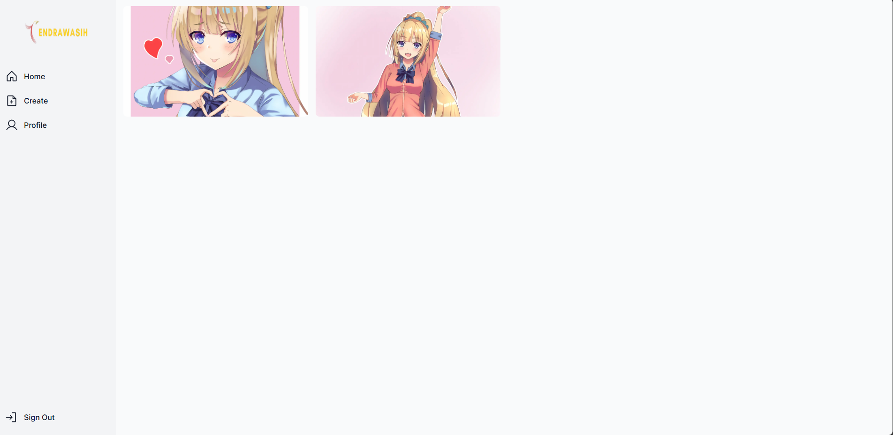
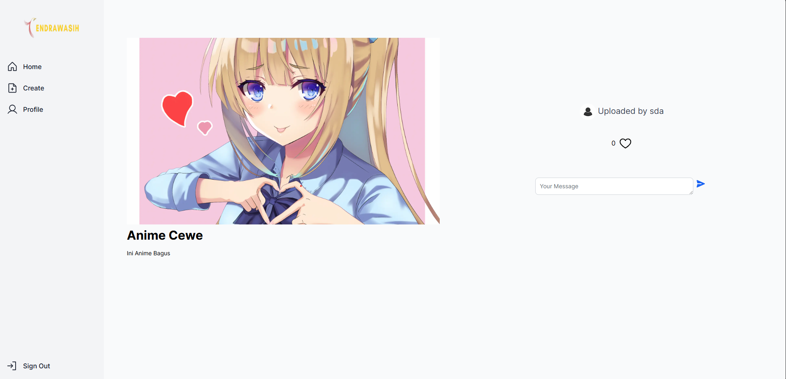

<h1>Cendrawasih - Website 💻</h1>

<p align="center">
  
</p>

<p align="center">Logo Candrawasih.</p>
<p align="center">This project inspiration come from sosial media website.</p>

## Sign In Page
<p align="center">
  
</p>
 
<p align="center">Sign In.</p>
<p align="center">We also have Sign Up.</p>

## Home
<p align="center">
  
</p>
 
<p align="center">Home Page || Explore more Image from world.</p>
<p align="center">Max data in Home Page is 20 but this website have unlimited scroll. if data value is more than 20 it will be generate more picture</p>

## Detail Page
<p align="center">
  
</p>
 
<p align="center">Detail Image Page</p>
<p align="center">In This page we have some fiture like a comment image and like image</p>

## Upload Page
<p align="center">
  
</p>
 
<p align="center">Uploading Image to database.</p>

## Installation For Window/RDP

```bash
npm i
npx prisma db push 
npm run build
npm start
```

## For Information
<p align="center">Please start a MySQL and Apache in XAMPP Control Panel.</p>