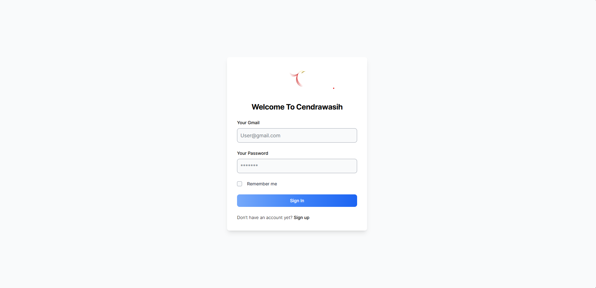
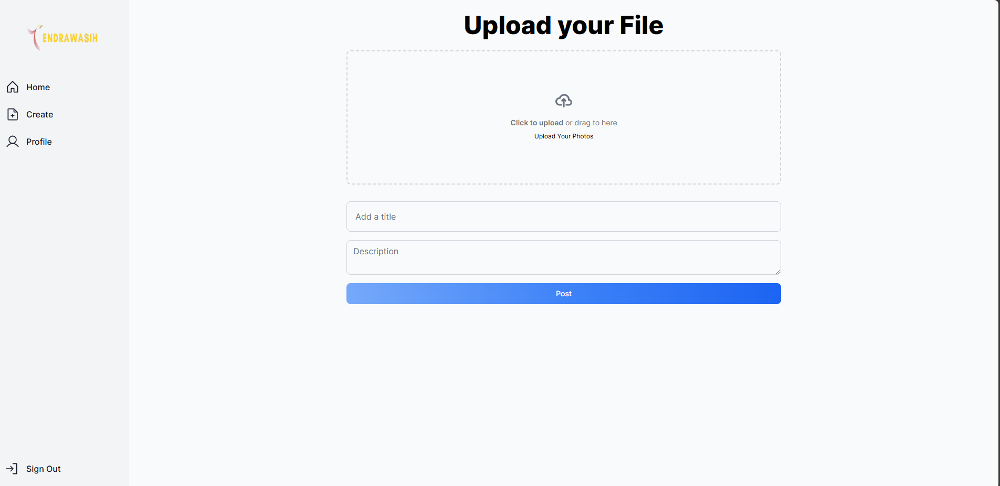

<h1>Cendrawasih - Website 💻</h1>

<p align="center">
  
</p>
 
<p align="center">Logo.</p>

<p align="center">
  
</p>
 
<p align="center">Sign In.</p>

<p align="center">
  
</p>
 
<p align="center">Uploading Image to database.</p>

## Installation For Window/RDP

```bash
npm i
npx prisma db push 
npm run build
npm start
```